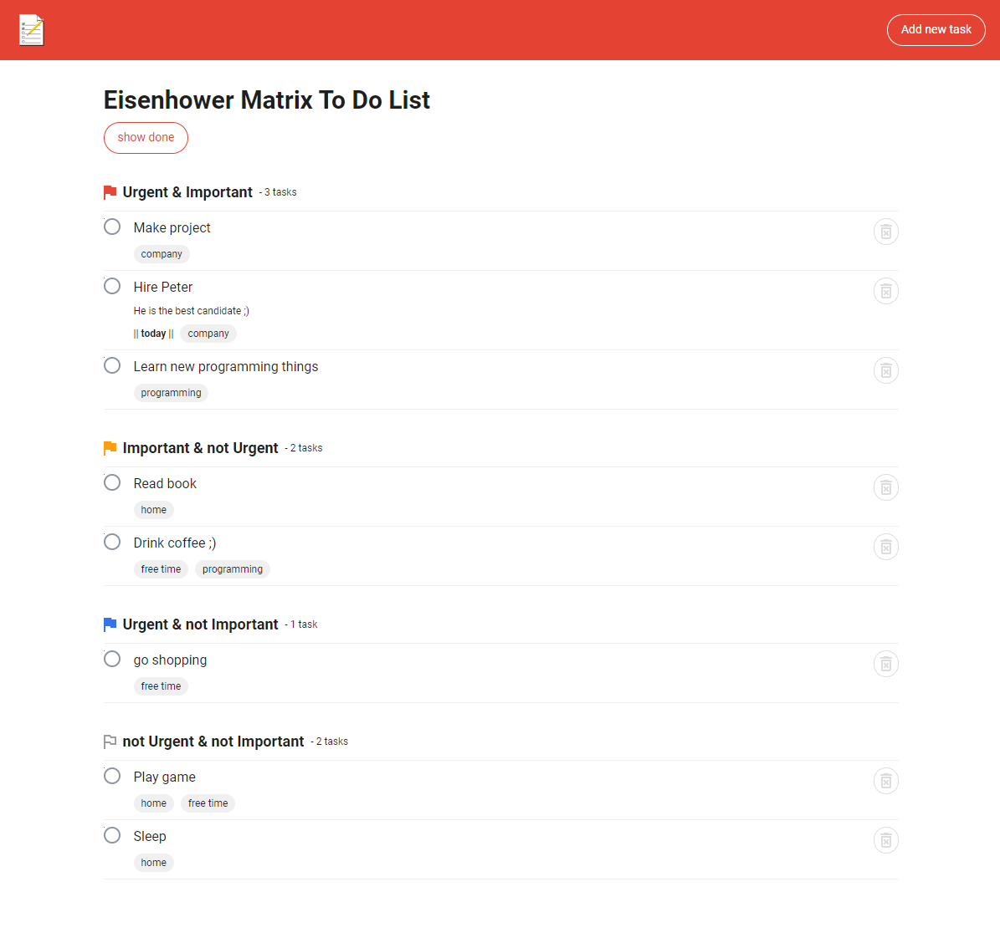
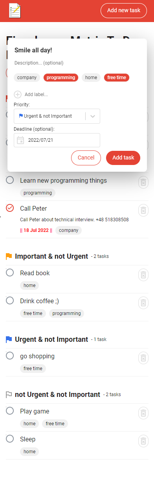

# Eisenhower Matrix To Do List

## Overview:

A simple app using Eisenhower Matrix. That is a very helpful tool in making decisions. Here you can
read more about the
[Eisenhower Matrix](https://todoist.com/pl/productivity-methods/eisenhower-matrix). Take happiness 
from raise of productivity.

- Demo on Netlify: [LINK](https://eisenhower-to-do-list.netlify.app/)
- Repo url: [LINK](https://github.com/PiotrRynio/eisenhower-matrix-to-do-list)

### Start:

1. npm install
2. npm run start

Others:

1. Compile and minify for production `npm build`
2. Run all tests `npm test`

## Project rules:

- [css order](https://css-tricks.com/poll-results-how-do-you-order-your-css-properties/)
- [commit notation](https://gist.github.com/brianclements/841ea7bffdb01346392c#type)
- [font-sizes](https://tailwindcss.com/docs/font-size)

## Chosen solutions:

1. This project is a recruitment task solution. I fulfilled **all the requirements**.
2. Since I did not receive a graphic design, I decided to use a design similar to the 
   [Todoist](https://todoist.com/pl/productivity-methods/eisenhower-matrix) app design because I 
   received description of The Eisenhower Matrix
   [in this app's blog](https://todoist.com/pl/productivity-methods/eisenhower-matrix) from the
   recruiter. In this blog I also found a graphic design of The Eisenhower Matrix in the
   **form of list**.
3. In the requirements there should be displayed a deadline date of the "Urgent" tasks. 
   I implemented this either for "Urgent and Important" tasks and "Urgent and not Important" tasks. 
   It should be consulted with the client.  
4. I created tests from different types of tests. Unfortunately limited free time did not let me 
   cover each component. I think that already existing tests create good presentation of my skills.
5. I decided to store data with use of local storage because it is only a frontend project and 
   it was good solution in this project and requirements. I did not receive any API from the
   recruiter. I was thinking about other solutions like session storage, cookies, IndexedDB,
   MSW, Firebase, etc. The recruiter told that I can use local-storage.

## Screens:

## Authors:

_Piotr Rynio_  
Contact:
pwrynio@gmail.com  
[github.com/PiotrRynio/](https://github.com/PiotrRynio)

